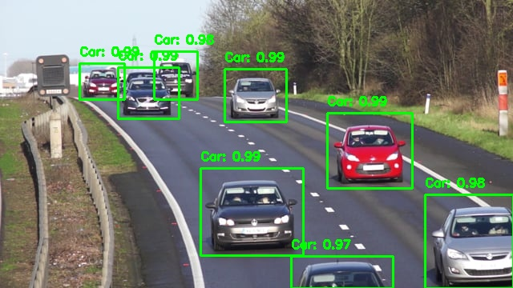
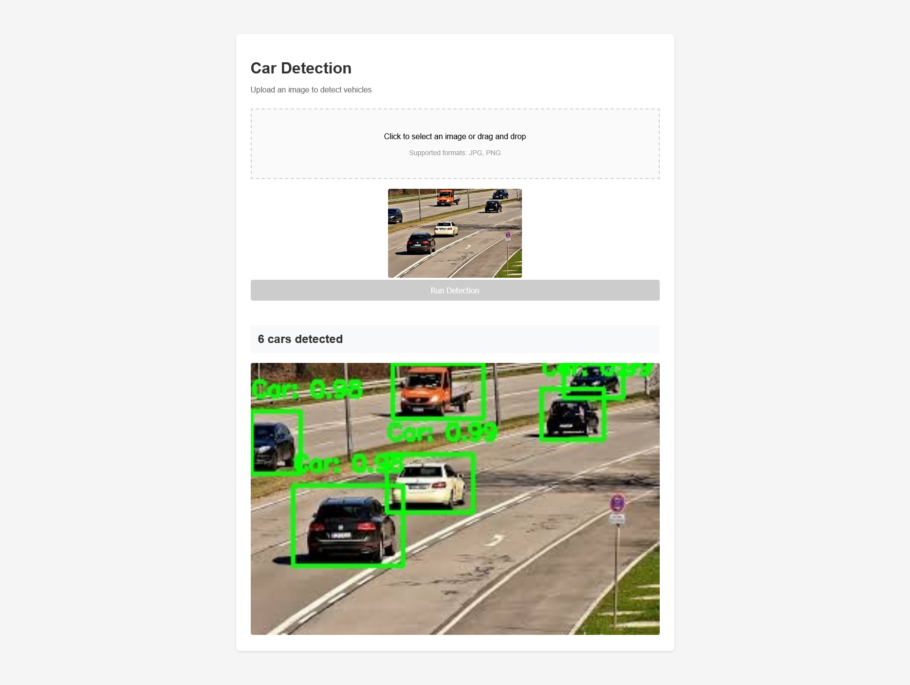

# Car Detection API

A custom-trained object detection system that identifies vehicles in street scene images. Built with Faster R-CNN and deployed as a REST API on Google Cloud Run with a web interface for real-time inference.



## Features

- **Custom-trained Faster R-CNN** model fine-tuned on street car dataset
- **REST API** with FastAPI for programmatic access
- **Web interface** with drag-and-drop image upload
- **Real-time inference** with bounding box visualization
- **Serverless deployment** on Google Cloud Run with auto-scaling

## Model Performance

- **59.1% mAP** (mean Average Precision across IoU 0.5-0.95)
- **94.8% AP50** (precision at 50% IoU threshold)
- **69.3% AP75** (precision at 75% IoU threshold)

Trained on ~350 labeled street scene images with bounding box annotations.

## API Endpoints

### `GET /`
Health check endpoint
```json
{
  "message": "Car Detection API",
  "status": "running"
}
```

### `POST /predict`
Returns JSON with detected cars, bounding boxes, and confidence scores
```json
{
  "num_cars": 2,
  "detections": [
    {
      "bbox": {
        "xmin": 100.5,
        "ymin": 200.3,
        "xmax": 300.2,
        "ymax": 400.8
      },
      "confidence": 0.95
    }
  ],
  "image_size": {
    "width": 640,
    "height": 480
  }
}
```

### `POST /predict/visualize`
Returns base64-encoded image with bounding boxes drawn
```json
{
  "num_cars": 2,
  "image": "base64_encoded_image_string"
}
```

## Web Interface

The web interface provides a user-friendly way to test the model:
- Drag-and-drop or click to upload images
- Real-time detection results
- Annotated images with bounding boxes
- Detailed detection list with coordinates and confidence scores



## Installation & Local Setup
```bash
# Clone the repository
git clone https://github.com/yourusername/car-detection-api.git
cd car-detection-api

# Install dependencies
pip install -r requirements.txt

# Note: Trained model file (model_final.pth) not included due to size
# Download from [link] or train your own following the training notebook
```

## Deployment

The API is containerized with Docker and deployed on Google Cloud Run.
```bash
# Build and deploy to Google Cloud Run
gcloud run deploy car-detection-api \
  --source . \
  --platform managed \
  --region us-central1 \
  --allow-unauthenticated \
  --memory 2Gi \
  --timeout 300
```

**Live API:** `https://car-detection-api-251509948200.us-central1.run.app`

## Testing with Postman

1. Create a POST request to `/predict`
2. Set body to `form-data`
3. Add key `file` with type `File`
4. Upload an image
5. Send request


## Tech Stack

**Model & Training:**
- PyTorch
- Detectron2 (Faster R-CNN ResNet-50 FPN)
- OpenCV
- Google Colab

**API & Deployment:**
- FastAPI
- Uvicorn
- Docker
- Google Cloud Run

**Frontend:**
- HTML/CSS/JavaScript
- Fetch API

## Project Structure
```
car-detection-api/
├── Dockerfile
├── requirements.txt
├── main.py
├── index.html
├── screenshots/
└── README.md
```

## Model Training

The model was trained using transfer learning:
1. Started with pre-trained Faster R-CNN (trained on COCO dataset)
2. Fine-tuned on custom street car dataset (~350 images)
3. Converted CSV annotations to COCO format
4. Trained for 1000 iterations with 80/20 train/val split

Training notebook available upon request.

## License

MIT License - see LICENSE file for details

